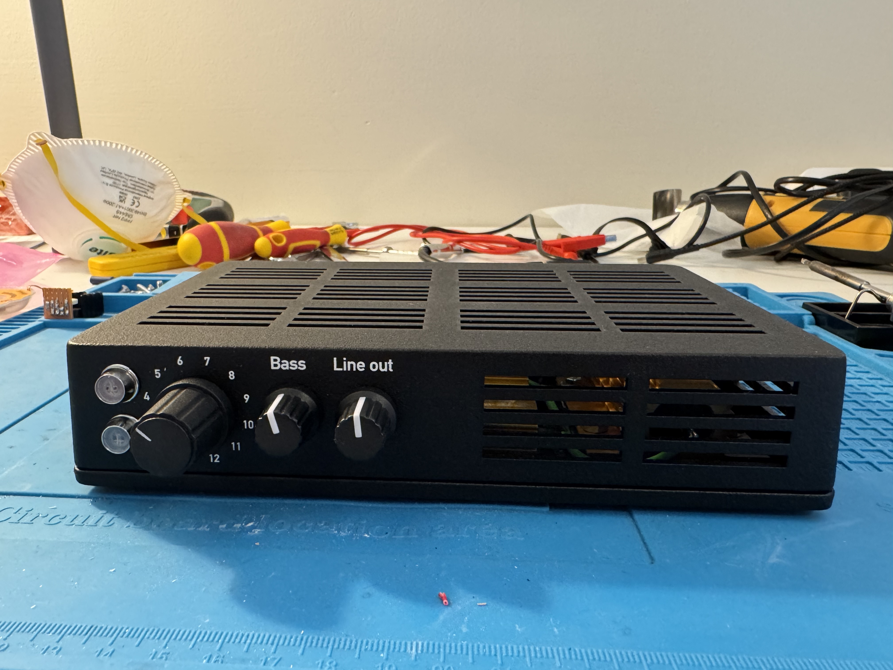
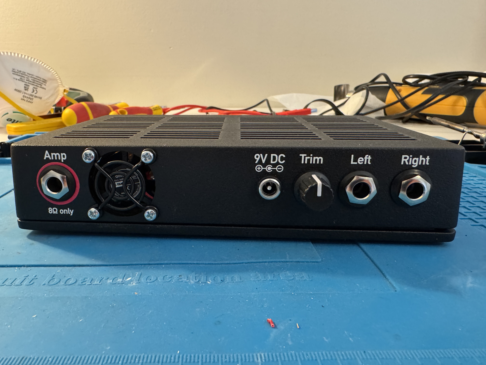
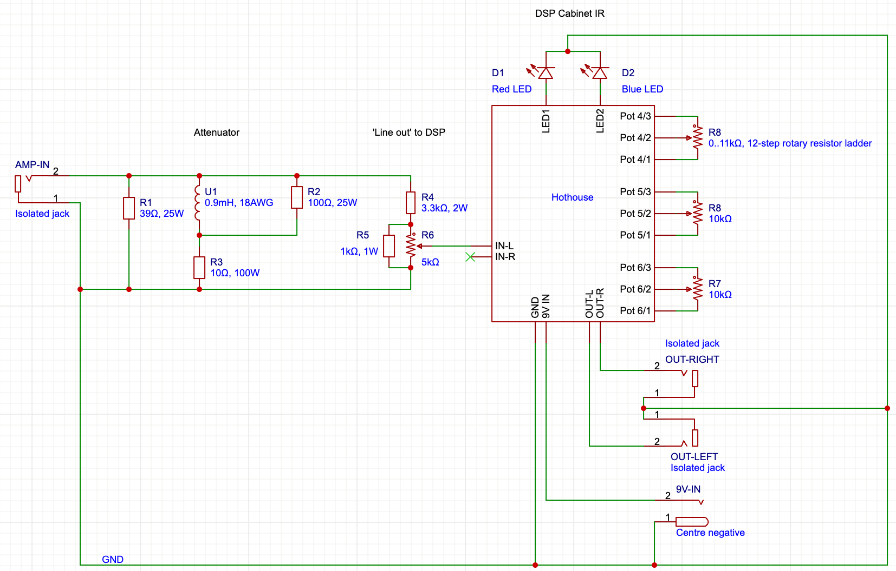
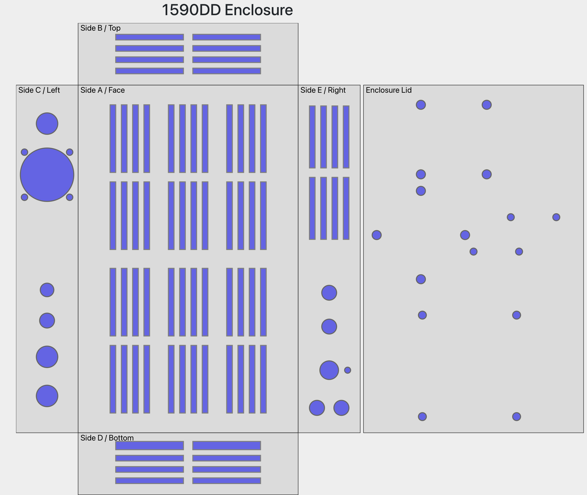
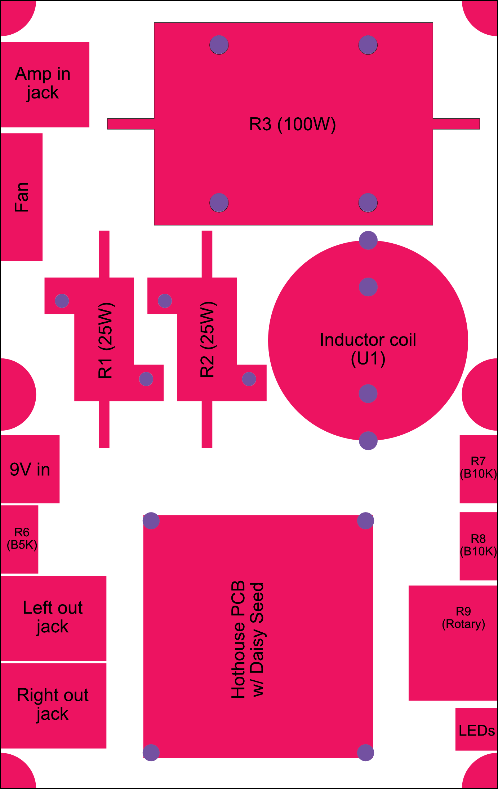
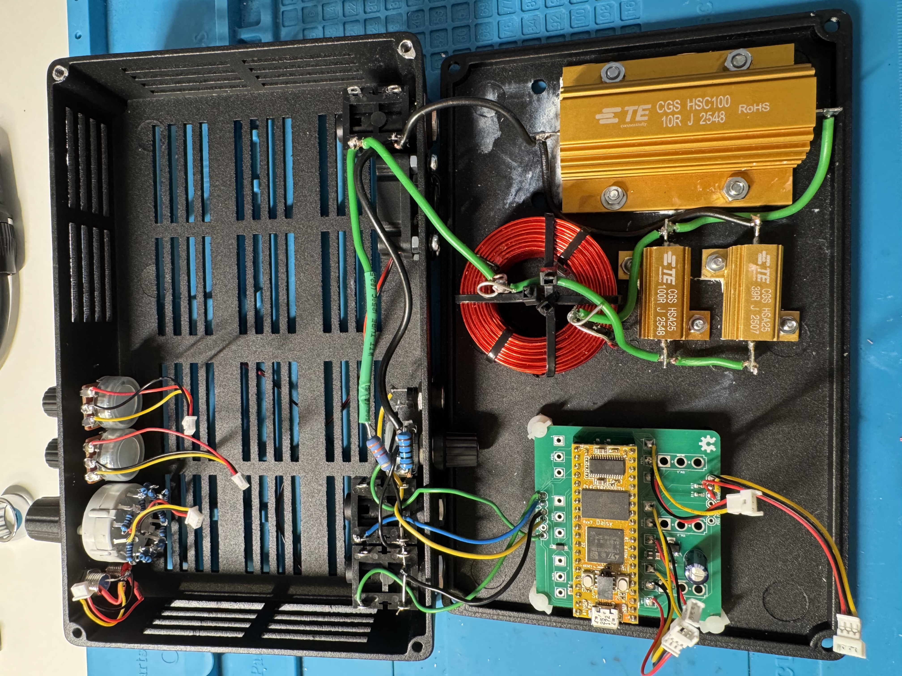
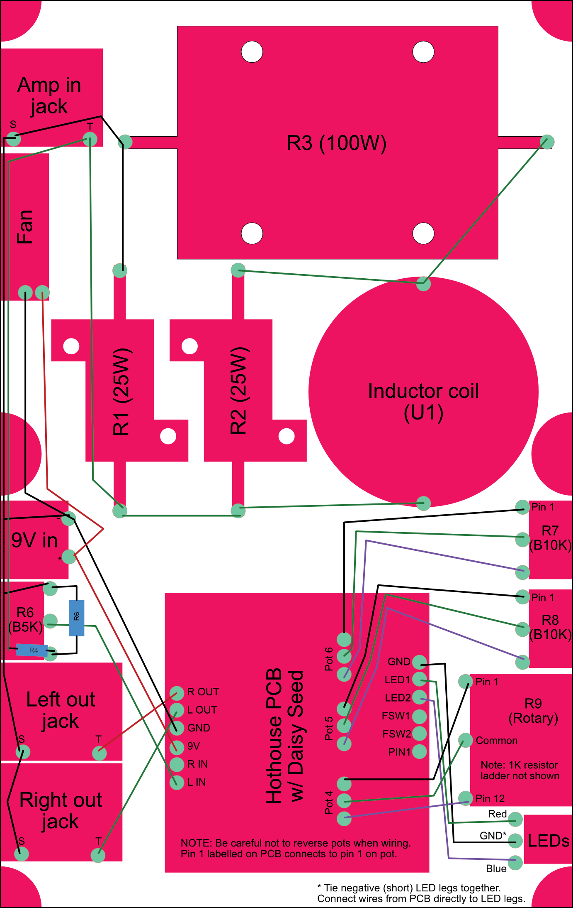
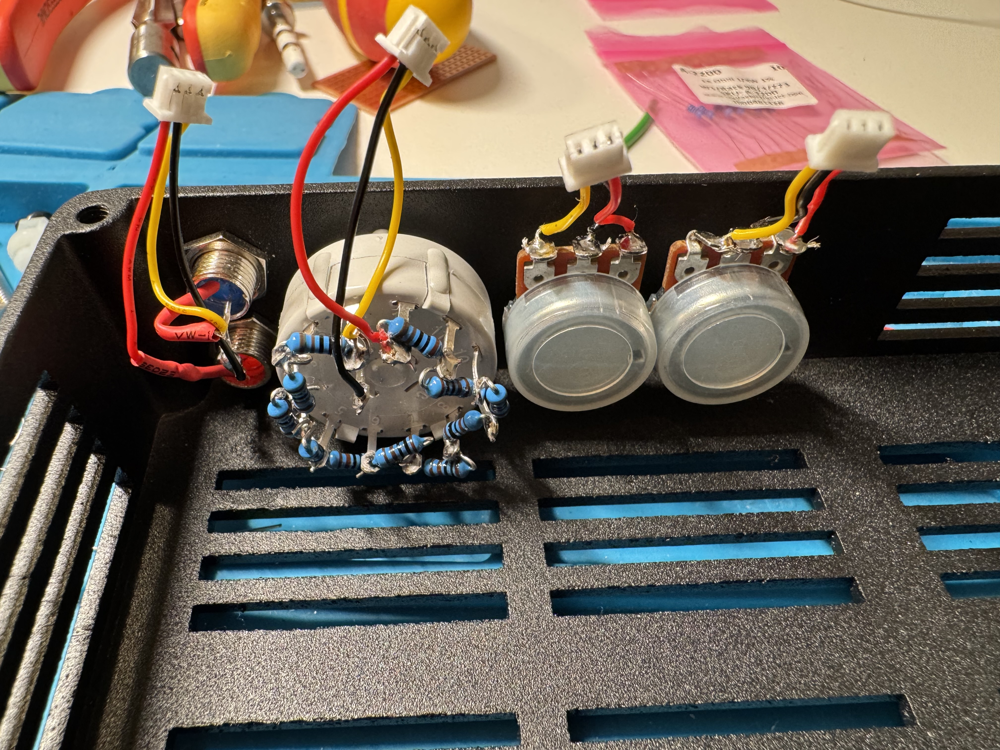
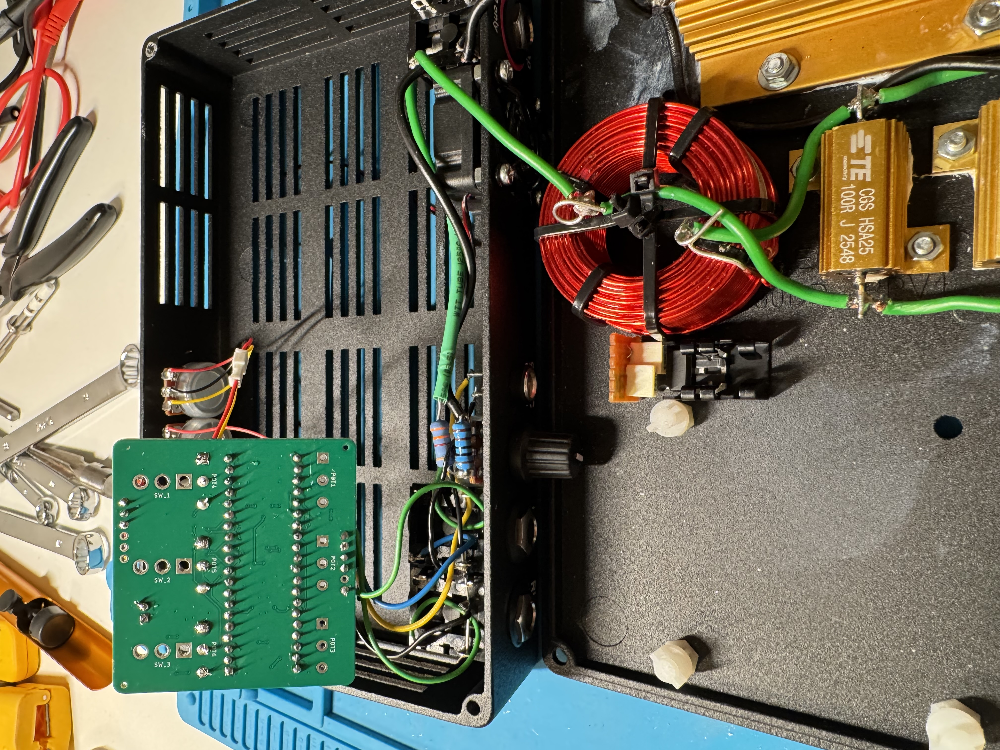

# Mulebox

A hardware guitar processing unit built with the Electrosmith Daisy Seed DSP module and Cleveland Audio Hothouse platform. It works as a reactive load box for silent playing, with cabinet simulation via Impulse Response files providing a line level, stereo output to e.g. speakers or a mixer. It does not have a headphone amplifier built in.

This document provides guidance for how to build your own. Both software and hardware are open source. You can build it as described here, or use this as a starting point for your own build of a similar device.

**WARNING #1:** The basic function of this box is to replace the speaker in an amplifier. A tube amplifier, in particular, will be damaged if used without a suitable load. Do not turn the amp on without a speaker or a load (like the one inside the Mulebox). If connections are made incorrectly, become loose, or are poorly soldered inside the Mulebox, the load could be disconnected. In this case, you could damage your amplifier.

**WARNING #2:** The components described here are for an 8 Ohm speaker output. Only plug into an 8 Ohm speaker output from your amplifier. The maximum rated power is 50W. It is safe to use a lower-powered amp, but do not use a higher-powered amplifier.

**WARNING #3:** This is a very tight build. You need to take care selecting components that can handle the required power, including wires. You need to be familiar with soldering, guitar electronics (e.g. you have built guitar amps or pedals before), and be capable of building the code for this software project using basic development tools.

You will also need to supply your own IR files, e.g. ones you have bought or recorded yourself.

## Operation

This is the assembled Mulebox:





To use it, connect a 1/4" TS **speaker cable** (not an instrument cable like the one you might use to plug your guitar into an amp or connect two effects pedals) from an 8 Ohm (only!) speaker output on your amplifier, into the amp input on the Mulebox rear.

Connect a pair of 1/4" TS audio cables from the left and right output jacks to a mixer or other recording device. If you want to connect to a pair of speakers, make sure they are either powered or that you use a suitable stereo amplifier. Note that the outputs are not balanced, and there is no headphone output.

Turn the rotary switch on the front to position 1. Connect a 9V DC, centre-negative (only!) "pedal" power supply to the power socket at the back. Turn the other knobs to noon.

The front knobs can be used to control the output level and cut/boost the bass, which might be helpful for certain types of amplifiers. The trim knob at the rear is used to control the input level between the amp and Hothouse. In general it should be as high as possible without causing clipping.

The red LED will stay on when the device is powered. It will blink if the signal starts to clip. In this case, turn down the trim knob.

The blue LED will stay on if an IR is loaded, and blink when it is being changed (by turning the rotary knob). If there are fewer than 12 valid IRs, some of the slots may be empty. In this case, the blue LED will remain off.

## Loading your own Impulse Response files

This project ships with four free IRs from [Djammincabs](https://zystrix.com/djammincabs.htm) as a starting point, but you should load your own IRs that you have either bought or recorded yourself.

Requirements:

- WAV format, 48kHz sample rate, mono or stereo
- Up to 12 files – if fewer, some positions on the rotary switch will be blank
- Each IR should be up to ~170ms – longer IRs will be truncated, but you can still use them

Note that files are assigned to rotary switch positions 1–12 in alphabetical order, so name them accordingly (e.g. `01_dark.wav`, `02_bright.wav`) to minimise confusion.

Steps:

1. Place your IR WAV files in the `irs/` folder.

2. Run the converter tool to regenerate the IR data header:
   ```bash
   python3 tools/wav_to_ir_header.py irs/*.wav -o src/ir_data.h
   ```

3. Connect the Daisy Seed to your computer via a USB cable, and put it in DFU mode by pressing boot and then reset.

4. Rebuild and flash to the Daisy Seed:
   ```bash
   make
   make program-dfu
   ```

5. Return the Daisy Seed to the Hothouse, power it on, and test the unit.

## Architecture

Think of the Mulebox as two separate devices hardwired together:

1. An attenuator, using a variant of the ["JohnH" Attenuator](https://marshallforum.com/threads/simple-attenuators-design-and-testing.98285/) design. This provides a reactive load that is both safe and provides an impedance curve that is similar to a speaker cabinet, which will make a tube amp "react" more appropriately.

The JohnH design can be used to build an attenuator box that quietens an amp whilst passing output to a real speaker in a guitar cabinet, with selectable levels of attenuation. The Mulebox does *not* support pass-through to a guitar cabinet. Instead it takes a "line out" signal and sends it to the DSP module.

The attenuator absorbs all the energy of the audio signal (up to 50W) and turns it into heat. Therefore, the attenuator gets hot. An aluminium chassis acts as a heat sink, and is cut with plenty of ventilation. There is also a small fan to provide airflow. This is important not only to ensure the passive attenuator components don't fail, but also since we are running a DSP module in the same box and this has a narrower operating temperature range.

2. A DSP processor that takes the raw amp sound and applies a selectable Impulse Response (IR) to it, emulating a guitar speaker cabinet, before passing the audio out as a stereo signal. This is based on the [Electrosmith Daisy Seed](https://electro-smith.com/products/daisy-seed) module, which can be programmed to perform a variety of audio-related functions (this is the source code repository for the Mulebox firmware, written in C++ for the Daisy platform).

The Daisy Seed needs to be connected to knobs and audio I/O. For that, we use the [Cleveland Music Co Hothouse](https://clevelandmusicco.com/hothouse/). This is a PCB that provides up to six knobs, three switches, two footswitches, two LEDs, and stereo audio input and output, originally intended in a guitar pedal form factor. Mulebox uses the Hothouse PCB, but not the breakout boards for the jacks and footswitches and LEDs. This runs on 9V "pedal power".

Note that the attenuator is entirely passive. This means that if you turn your amp on but leave the Mulebox unpowered (there is no on/off switch), your amp is still safe. However, the cooling fan will not run, so it is advisable to leave it powered on whenever the amp is in use.

The Mulebox lives inside a "Hammond 1590DD" size enclosure – mainly because this is the largest enclosure one can order from Tayda Electronics and have them paint and drill. It is of course possible to use a different box, so long as it has the required cutouts and enough ventilation, but we provide Tayda drill and UV print templates below, which make it much easier to get a professional-looking enclosure.

Here is the schematic of the full circuit:



## Hardware components

When selecting hardware components to use, it is important to consider not only their values (e.g. resistance and power rating/wattage for the resistors; inductance for the inductor coil), but also the physical dimensions of each. The Tayda drill template provided will need to be modified for any components with a different footprint from the ones suggested below. This is most important when it comes to the large, high-powered resistors. Since these are clamped to the bottom (technically the "lid") of the enclosure, it might be preferable to drill these manually.

### The Daisy Seed

First, buy the [Daisy Seed](https://electro-smith.com/products/daisy-seed) – the brains of the operation.

The Hothouse does not come with it. You can buy it from Electrosmith directly, or a third party seller close to you. It can be reprogrammed as many times as you like and used for other projects (e.g. using the Hothouse platform in its default pedal-sized enclosure).

### The Hothouse PCB

Next, you need the [Hothouse](https://clevelandmusicco.com/hothouse-diy-digital-signal-processing-platform-kit/).

This is what the Daisy Seed will mount to to gain access to audio I/O, knobs (pots), and LEDs. Ideally, buy the Hothouse from Cleveland Music Co. They sell a version without an enclosure, which will save you a bit of money, whilst still supporting the developers of the Hothouse.

However, the fine folks at Cleveland Music Co have made the PCB available as [open hardware](https://github.com/clevelandmusicco/open-source-pedals/tree/main/hothouse) which means that you can also manufacture your own from their "Gerber" files – probably using [JLCPCB](https://jlcpcb.com). In this case, you want the main PCB only (not the footswitch or I/O breakout boards), and you probably want to get JLCPCB (or whoever you use) to provide and solder the SMD components for you.

There are several online tutorials that explain how to do this, but the basic idea is that you upload the Gerber (.zip) and Bill of Materials (.csv) file for the main PCB to the JLCPCB website, and choose their PCB assembly service. It's a very slick process. You will probably have to order at least five boards, but even then it's pretty affordable (plus you now have spares).

If you go this route, you will also need to buy two single-row, 20-pin, 2.54mm pitch female square-pin headers and a 100uF low-ESR electrolytic capacitor, which are otherwise included in the Hothouse kit.

You will also need pots, jacks, a power socket, and LEDs, but we'll detail those below, as you'll need to get them regardless of whether you buy the Hothouse kit or manufacture your own PCBs. The components that come with the Hothouse are different from what we will mount in the Mulebox.

#### PCB mounts

The Hothouse PCB is meant to hang from its pots and switches, but for the Mulebox we'll need to mount these to the front and back of the chassis and wire them to the board. That means we need another way to mount the PCB, without having it touch the chassis itself. Unfortunately, there are no mounting holes on the Hothouse either.

Instead, we can use four Essentra TCEHCBS-4-01 PCB mounts and some #6 screws (or M3.5 size metric ones). These snap around the corners of the board. The drill template below is spaced for these. They are available from many places, including (with screws) [The Pi Hut](https://thepihut.com/products/14-corner-edge-standoffs-set-of-4).

### The inductor coil

Next, you need an inductor coil: literally a large coil of thick wire wound into a coil. This is what makes the load "reactive" and helps ensure the amp acts and feels like a real speaker is connected.

For an 8 Ohm, 50W build, you want an "air core", 18AWG coil with an inductance of 0.9mH, such as the [Dayton Audio LW18-90](https://www.soundimports.eu/en/dayton-audio-lw18-90.html). These will usually be stocked by specialist audio hardware or repair shops, rather than general purpose electronics retailers.

The coil needs to be mounted in such a way that it does not touch any other metal components, including the enclosure. It is also pretty large, and so a tight fit. The Dayton Audio coil comes with a pair of plastic zip ties to hold the coil together, and you can use the thicker fastener on the zip ties as a spacer, keeping it off the bottom of the enclosure. The suggested layout/drill template has two holes drilled to run additional zip-ties through, for fixing the coil in place.

### The large resistors

The circuit calls for three large, wirewound resistors: one rated at 100W and two at 25W. Again, these take up a lot of room and they get hot.

In contrast with the inductor coil, it is very important to bolt these securely to the metal enclosure, with a small amount of thermal conduction paste smeared on the bottom. This helps turn the enclosure itself into a heatsink, dissipating heat more effectively.

The suggested layout/drill template is based on resistors from the TE Connectivity HSA series (see links below). This choice is somewhat arbitrary, and there are other manufacturers. However, you will need to either drill your own, precise mounting holes, or adjust the drill template by referring to the relevant technical drawing, as the hole spacing is not standard across manufacturers.

### The cooling fan

Speaking of heat dissipation, the design includes a small fan at the rear, intended to pull cool air through slats at the front and sides of the enclosure across the resistors, expelling hot air at the back. A large circular cutout exposes the fan, and is then protected with a metal "finger grille".

The drill template has space for a 30mm square extractor fan with standard hole spacing. This is _very tight_ and might require some creativity when mounting and closing the lid. You may need to add a bit of extra spacing with a nut or small washer on the inside of the enclosure, to allow the lid to close.

Cheap fans are noisy. Quiet fans don't move a lot of air. The quality of the fan will make a difference.

The fan needs to run off the 9V power supply. You can get fans that run natively on 9V, or e.g. 12V fans that will just run a bit slower at lower voltages. A lower-voltage fan (e.g. a 5V fan) will require additional components to step the 9V voltage down to 5V.

**TODO**: Link to specific fan (once tested)

**TODO**: Fan power details (once tested)

### The enclosure

Apart from needing to fit all the components, the most important facet of the enclosure is that it needs to help manage heat effectively. A 50W amplifier at full volume generates enough power to create serious heat, which could cause the Daisy Seed to shut down or impact the performance of the circuit in other unpredictable ways. An aluminium enclosure can act as a heatsink in its own right if the large resistors are clamped securely to it, but we also need to cut ventilation holes.

Since the components (just!) fit inside a Hammond 1590DD enclosure, we can use [Tayda Electronics](https://www.taydaelectronics.com) to paint, drill, and UV print an enclosure for us. See [this guide](https://martinaspeli.net/posts/tayda-uv-printing/) for more details about that process, including how to set up the UV print templates.

You can use [this drill template](https://drill.taydakits.com/box-designs/new?public_key=ZWw5MmVRSTM3OFlKMW1BK1VXT1NrZz09Cg==) as your starting point, which looks like this:



We will use the "lid" of the enclosure as the base, drilling several mounting holes for the large resistors, induction coil, and the Hothouse PCB standoffs.

**Note** that Tayda drill the lid _from the outside_ but we are mounting from the _inside_, which means the drill holes need to be translated accordingly. The template matches the screw spacing of the components listed in the shopping list below, but these will likely need adjusting if you use other brands. Alternatively, remove these holes from the drill template and drill them manually once you have all your components laid out – the base will not be visible in any case.

"Side E" will be used as the front, mounting two LEDs in bezel holders, the rotary switch, and the output level and bass control pots. It also contains crucial slat cutouts that sit in front of the large resistors, directly opposite the fan, allowing it to draw cool air across the top of the resistors. The potentiometer and switch cutouts match the UV print template for the front.

"Side C" will be used as the back. It contains cutouts for the jack sockets, the "trim" knob that is used to adjust the volume of the attenuated signal going into the Hothouse, and a large cutout for the fan. Again, the position of these holes match the UV print template for the back.

The top and sides contain a large number of slats – so many in fact, that you need to order "extra holes" from Tayda for them to be willing to cut them. See below.

Please review the Tayda drill and UV print guide, and see the list below to understand which components and services to buy to manufacture the enclosure. Alternatively, if you wish to drill your own enclosure, see the [Layout](docs/cutouts/) directory in this repository, which contains SVG files with precise hole positions and dimensions that match the Tayda template. You can even use [this tool](https://claude.ai/public/artifacts/d6972198-d8ba-438f-a263-92a109cfab29) to extract the positions and dimensions of each cutout.

Resources:

* [Tayda Electronics Drill template](https://drill.taydakits.com/box-designs/new?public_key=ZWw5MmVRSTM3OFlKMW1BK1VXT1NrZz09Cg==)
* [Tayda Electronics UV templates in PDF format](./docs/uv/) for the front (side E) and back (side C) with white, gloss and colour layers
* [Affinity Designer files](./docs/) for each side, including drawings of the cutouts in the drill template

### Other components and shopping list

You need the components below. We suggest ordering everything that is available from Tayda Electronics if you are going to also have them drill and print the enclosure, because their components are cheap and their shipping is better done in bulk. Other components are listed from Farnell. You can of course choose whatever supplier you want, and use equivalent components, though you may then need to adjust some of the enclosure cutouts and other aspects of the layout.

#### Tayda Electronics

(SKU numbers in brackets)

* 1 x red 5mm LED ([A-1554](https://www.taydaelectronics.com/led-5mm-red.html))
* 1 x blue 5mm LED ([A-3005](https://www.taydaelectronics.com/led-5mm-blue-lens.html))
* 2 x 5mm LED bezels ([A-660](https://www.taydaelectronics.com/5mm-bezel-led-holder-chrome-metal.html))
* 2 x B10K mini pots with solder lugs ([A-1961](https://www.taydaelectronics.com/10k-ohm-linear-taper-potentiometer-with-solder-lugs.html))
* 1 x B5K mini pot with solder lugs ([A-1970](https://www.taydaelectronics.com/5k-ohm-linear-taper-potentiometer-with-solder-lugs.html))
* 3 x dust seals for pots, unless supplied with pots ([A-5527](https://www.taydaelectronics.com/dust-seal-covers-for-potentiometer.html))
* 3 x small knobs for 6mm splined pots, ~16mm (e.g. [A-6071](https://www.taydaelectronics.com/black-knob-white-indicator-16x15mm.html))
* 1 x 100uF electrolytic capacitor ([A-959](https://www.taydaelectronics.com/100uf-25v-105c-jrb-radial-electrolytic-capacitor-6-3x11mm.html)) – unless supplied with a full Hothouse Kit
* 2 x 20pin female headers ([A-1310](https://www.taydaelectronics.com/20-pin-2-54-mm-single-row-female-pin-header.html)) – unless supplied with a full Hothouse kit
* 11 x 1K 1/4W metal film resistors ([A-2200](https://www.taydaelectronics.com/10-x-resistor-1k-ohm-1-4w-1-metal-film-pkg-of-10.html)) – used for the rotary switch resistor ladder
* 1 x 1K 1W metal film resistor ([A-2196](https://www.taydaelectronics.com/resistor-1k-ohm-1w-1-metal-film-pkg-of-10.html)) – higher power rating, used for the attenuator circuit 
* 3 x _isolated_ jack sockets ([A-6042](https://www.taydaelectronics.com/6-35mm-1-4-mono-insulated-switched-socket-jack-solder-lugs.html))
* 1 x small _isolated_ DC power socket ([A-991](https://www.taydaelectronics.com/dc-power-jack-2-1mm-round-type-panel-mount-1.html))
* 4 x 10mm M3 bolts ([A-1252](https://www.taydaelectronics.com/m3-steel-screw-cross-round-head-m3x10mm.html)) and nuts ([A-1247](https://www.taydaelectronics.com/nut-3mm-for-screw-m3.html)) – for mounting 25W resistors
* 4 x 10mm M4 bolts ([A-4351](https://www.taydaelectronics.com/m4-steel-screw-cross-round-head-m4x10mm.html)) and nuts ([A-4357](https://www.taydaelectronics.com/nut-4mm-for-screw-m4.html)) – for mounting 100W resistor
* 4 x 25mm M3 bolts ([A-1257](https://www.taydaelectronics.com/m3-steel-screw-cross-round-head-m3x25mm.html)) and nuts ([A-1247](https://www.taydaelectronics.com/nut-3mm-for-screw-m3.html)) – for mounting cooling fan and finger grille

And for the enclosure:

(skip all these if using a different/custom-drilled enclosure)

* 1 x 1590DD enclosure in a suitable colour (e.g. [A-5906](https://www.taydaelectronics.com/matte-black-sand-texture-1590dd-style-aluminum-diecast-enclosure.html))
* 1 x 1590DD custom drill service ([A-5141-CST-DR1](https://www.taydaelectronics.com/1590dd-custom-drill-enclosure-service.html))
* 1 x 1590DD lid custom drill service ([A-5141-CST-DRL](https://www.taydaelectronics.com/1590dd-lid-custom-drill-enclosure-service.html)) – you can skip this if you prefer to place and drill your own mounting holes for the large resistors, induction coil, and PCB
* 64 x additional hole drilling service ([A-99999-CST-DR-H1](https://www.taydaelectronics.com/drill-service-additional-holes.html)) – adjust this so that the total number of cutouts in the enclosure is covered (40 holes are included in the default drilling service, so 40 + 64 = 104 total holes)
* 1 x 1590DD side C UV print service ([A-5141-CST-UVC](https://www.taydaelectronics.com/1590dd-side-c-uv-printing-service-1.html))
* 1 x 1590DD side E UV print service ([A-5141-CST-UVE](https://www.taydaelectronics.com/1590dd-side-e-uv-printing-service-1.html))
* 1 x gloss layer UV print service ([A-99999-CST-UV-GL](https://www.taydaelectronics.com/custom-uv-gloss-layer-service.html)) – optional, but recommended to protect the printed labels
* 1 x "print twice" white layer UV print service ([A-99999-CST-UV-WH](https://www.taydaelectronics.com/93825-dup-custom-uv-white-layer-service.html)) – optional, but recommended if printing white on black

#### Farnell

(Order codes in brackets)

* 4 x TCEHCBS-6-01 PCB standoffs ([4691573](https://uk.farnell.com/essentra-components/tcehcbs-6-01/pcb-mounting-nylon-6-6-9-5mm/dp/4691573)) – plus suitable screws (#6 or M3.5, self-tapping). Alternatively, [this kit from PiHut](https://thepihut.com/products/14-corner-edge-standoffs-set-of-4) contains both the standoffs and the screws.
* 1 x 12-position make-before-break rotary switch – Lorlin CK1034 ([1123690](https://uk.farnell.com/lorlin/ck1034/switch-1-pole-12-pos-0-15a-250v/dp/1123690)) – note this has an imperial sized 6.35mm (1/4 inch), D-shaped spindle and so requires a suitable knob. There is a metric version of the same switch (CK1024) which can take a 6mm D-shaft knob, but the front cutouts will then need to be adjusted.
* 1 x 3K3 2W metal film resistor - used for the attenuator circuit ([1738645](https://uk.farnell.com/neohm-te-connectivity/rox2sj3k3/res-3k3-5-2w-axial-metal-oxide/dp/1738645))
* 1 x Fan finger guard for 30mm fan, e.g. Multicomp Pro MCSC30-W1B ([1781195](https://uk.farnell.com/multicomp-pro/mcsc30-w1b/fan-finger-guard-metal-30mm-black/dp/1781195))
* 1 x 10 Ohm, 100W resistor, e.g. TE Connectivity HSC10010RJ ([1174288](https://uk.farnell.com/cgs-te-connectivity/hsc10010rj/resistor-100w-5-10r/dp/1174288))
* 1 x 100 Ohm, 25W resistor, e.g. TE Connectivity HSA25100RJ ([2009323](https://uk.farnell.com/cgs-te-connectivity/hsa25100rj/resistor-alu-housed-100r-5-25w/dp/2009323))
* 1 x 39 Ohm, 25W resistor, e.g. TE Connectivity HSA2539RJ ([2805189](https://uk.farnell.com/cgs-te-connectivity/hsa2539rj/resistor-wirewound-39r-5-25w/dp/2805189))

#### Other items

* 1 x medium knob for 6.35mm D-shaft rotary switch, ~19mm, with the pointer towards the _flat_ edge (assuming you are using the Lorlin CK1034 rotary switch). These can be a bit hard to source, but the [Cliff K21 D-shaft 1/4" knobs](https://www.digikey.co.uk/en/products/detail/cliff-electronic-components-ltd/CL178886/26698222) with a suitable cap works.
* 1 x [Daisy Seed](https://electro-smith.com/products/daisy-seed) – see above
* 1 x [Hothouse main PCB](https://clevelandmusicco.com/hothouse-diy-digital-signal-processing-platform-kit/) – see above
* 1 x 30mm extractor fan – see above
* 22 AWG or similar (i.e. thick) wires, preferably in a few different colours, for wiring the attenuator.
* Thinner wire in multiple colours for wiring up the Hothouse to the output jacks, LEDs, and potentiometers.
* Optional: For wiring the front pots, LEDs, and rotary switch, you can use sets of wires with 3-pin JST 1.25mm (or larger) connectors (you'll need both male and female). The advantage of this is that you can easily disconnect the front components when opening the enclosure.
* Plastic zip ties for mounting the inductor coil
* Thermal paste (only a tiny amount) for mounting the large resistors

### Tools and consumables

You will need:

- A good quality soldering iron with both a pencil tip for PCB soldering and a larger tip for the large resistors, jacks, and so on.
- Other soldering tools – high quality solder, an extractor fan and/or mask to avoid breathing in fumes, a solder sucker for rework, helping hands or clamps, etc.
- Screwdrivers, pliers, wirecutters, wire strippers, spanners in various sizes to affix pots to the enclosure, etc.
- A multimeter that can measure resistance and continuity (beep mode)

## Assembly

You've ordered the parts. Waited for the delivery driver. Laid everything out. It's time to put it all together!

The Mulebox in a 1590DD enclosure is a tight fit. You want to think carefully about cable length and dress, and avoid any components unintentionally touching, which could lead to grounding issues or shorts.

Here is an illustration of the final component layout, as if looking down from the top of the inside of the lid (i.e. the base of the unit), with the front- and back-mounted components seen from above.



You will mount the largest components to the removable "lid" (in our case the base), but the other components (jacks and pots) are on the back and front long sides. This creates a problem, because you need wires running from the base to the front and back. If these are too short, you will be unable to connect them. If they are too long, they will get in the way of the internal components or block the fan (and increase the risk of shorts) when the box is closed.

We recommend that you assemble the unit with the lid and box opened like a clamshell, lying as close together as possible along the rear long edge. In this position, run cables that are as short as possible from the rear jacks and pots to the relevant points on the base. You can have a bit more leeway with the front components, which use thinner wires, though it's even more elegant to use small plastic JST connectors that can be done up with the lid partially closed. Care and planning is everything.



(**Note**: The build in this photo is not identical to the suggested layout above – the inductor coil and 25W resistors have been swapped around due to a drilling error. It is however electronically identical. This uses wires with JST connectors for the front-mounted components.)

It can also be useful to fit only three of the four PCB corner mounts to begin with. This makes it easy to take the PCB out so it can float inside the enclosure with the lid open. All the wires to the front of the unit run directly to the PCB.

Here is one feasible layout that aims to minimise cable runs. Note that the wires that attach to the resistors, inductor coil, input jack should be 22AWG (thick, handling the higher current of the amp signal). The ones connecting to the PCB should be thinner, handling only the electronics and line level audio signal.



### Recommended build order

We will start with the attenuator and line out:

1. Begin by placing the large resistors (1 x 100W, 2 x 25W) as shown in the layout. Smear a very thin layer of thermal paste on the bottom and bolt them securely to the lid, with the nuts on the inside (i.e. the side where the resistors are mounted) and the screws on the outside.

2. Fix the inductor coil in place using zip ties. Be careful that it does not wobble around, and that no part of it touches any metal components, including the enclosure.

3. Screw in place the rear and front-left PCB standoffs, but leave the front-right standoff off for now.

4. Insert the amp-in jack at the right of open (upside-down) enclosure, making sure to use an isolated jack as specified so that no metal part of the jack touches the enclosure.

5. Insert the fan finger grille from the outside, and then run longer M3 bolts through its mounting holes and the screw holes on the enclosure. Then insert the fan with the wires running towards the middle of the enclosure. This might be difficult and require some force and/or careful adaptation of the plastic parts of the fan. If the fan is flush to the enclosure, you may struggle to fit the lid back on. It is worth testing this now before soldering in any wires, and either add a nut for some extra spacing to allow the lip of the lid to slide into place, or gently cut away a small part of the fan casing. Then use nuts on the inside to keep the fan secure.

6. Mount the 9V power socket, the B5K pot (remember to snap off the key pin that will stop it from sitting flush with the enclosure, and to add the plastic dust seal to the rear), and the two output jack sockets in place. This completes the rear of the enclosure (which will be lying, upside-down, close to the rear of the lid if you have placed them like an open clamshell).

7. Run 22AWG (thick) wires between the large resistors, inductor coil, and rear jack as shown in the wiring diagram. If you have the enclosure open and upside down, realise that the diagram is a bird's eye view onto the inside of the lid, so the rear-mounted components will be upside down! Keep wires as short and neat as possible, and strip enough insulation off to wrap securely into the solder lugs, but no more. Double check your wires, then solder everything to the large resistors and inductor coil (i.e. the components mounted to the lid). Don't solder the input jack socket yet.

8. Run an extra length of 22AWG wire from the sleeve (ground) of the jack socket to the pin of the B5K pot at the rear that is _closest_ to the input jack socket if you mounted the socket with the lugs facing out of the enclosure (i.e. "up" when the enclosure is upside down) – pin 1. You can now solder the ground wire from the large resistors and this new wire to the input jack socket.

9. Solder one side of the 2W, 3K3 "small" resistor to a wire, and protect the exposed leg with some heatshrink tubing. Do not put heatshrink over the resistor body itself! Make sure the wire is long enough to reach from the tip (hot) of input jack socket to pin 3 of the B5K pot on the rear, which means the pin that is _furthest_ from the input jack socket. Solder the wire end to the tip lug of the input jack socket alongside the wire that runs to the large resistors on the lid.

10. Place the other "small" resistor, 1K, 1W, between pins 1 and 3 of the B5K pot. Insert the ground wire from the sleeve of the input jack into pin 1 and the loose end of the 2W resistor that connects to the tip of the input jack to pin 3. Solder a further short wire to the same lug as the ground – we will use this later to connect to the "ground bus". Keep the exposed resistor legs as short as possible, and solder both lugs, snipping off any excess. Leave the wiper (middle) lug of the B5K pot unsoldered for now – this is our line out to the Hothouse PCB.

At this point, you should have all three large resistors, the inductor coil, and three of the PCB standoffs securely mounted to the lid, with thermal paste under the large resistors. The fan will be in place, and the input jack socket will be connected, with two wires running across towards the B5K pot. The wire from the tip of the input jack socket will end in a 3K3 2W resistor. A 1K 1W resistor will be soldered across the outer lugs of the pot, one side shared with the 3K3 2W resistor and the other side shared with the wire to the amp in sleeve (ground).

Next we need to prepare the rotary switch.

1. Identify pin 1 and pin 12 on the switch. Insert a short wire and one end of a 1K 1/4W resistor in the lug for pin 1. In lug 2, insert one side of a second 1K resistor alongside the other leg of the resistor connected to pin 1. Continue this up to pin 12, where you should also insert a second wire. The idea is to create a "ladder", where there is a 1k resistor between each adjacent pair of pins, and also a wire at the first and last pins.

2. The common pin should be in the middle. Solder a third short wire to it.

3. Mount the rotary switch to the front panel of the enclosure.

You can test the rotary switch with a multimeter. It should measure close to zero resistance between the pin 1 wire and common in position 1, 1k between those same wires in position 2, 2k in position 3, and so on. In this regard, it will act like an 11k potentiometer where the measured value between pin 1 and the common moves in steps of 1K as the switch is turned. The value between pin 12 and the common will be 11k in position 1, 10k in position 2, and so on, and 0 in position 12.

Here is a close-up of a completed rotary switch with the 1k resistor ladder.



Now we can turn our attention to the PCB.

1. Complete the Hothouse PCB, outside the enclosure. The surface-mounted components should already be in place if you ordered it from Cleveland Music Co. or used the PCB assembly service, but you will need to solder in the female headers that seat the Daisy Seed itself, as well as the 100uF electrolytic capacitor. Remember that these are polarised! Do not solder any pots, switches, or ribbon cables to the Hothouse PCB.

2. Place the PCB into the three installed standoffs. This helps you gauge the length of wires required. You can solder wires to the top of the PCB, though be careful not to touch any other components while you do!

3. At the rear of the PCB, solder a wire from the "LIN" pad to the middle lug (wiper) of the B5K pot on the rear. This is the audio input, and since it's mono, we'll use only the left channel. The "RIN" pad will remain empty.

4. Solder a wire from the "ROUT" pad to the tip lug of the right output jack socket, and from the "LOUT" pad to the tip of the left output jack socket.

5. We will now create a ground bus. The goal is to connect the GND pad at the rear of the PCB to the sleeve lug of one of the nearest output jack socket, and then run that to the sleeve lug of the adjacent output jack socket, the ground pin of the B5K socket (which itself is connected to the sleeve of the input jack socket), and eventually to the ground pin of the 9V power socket. There are a few ways you can do this, but one way is to use a short piece of solid core wire that has been fully or partially stripped, placing this through the ground lugs of the jack sockets as a bar that you can then wrap other wires around before soldering them together. You want to avoid ground loops (multiple parallel ground paths), and ensure that any exposed wire cannot come into contact with any other components and accidentally create a short. Do not solder to the 9V socket yet, as we also need to account for the fan.

At this point, the connections to the rear of the PCB will be in place, and there will be four trios of wires that need to connect to the front of the enclosure – three for the LEDs, three for the rotary switch, and three for each of the two pots. If you have left the enclosure open like a clamshell along the rear long edge, you have been able to run short wires to the PCB and large resistors that will fold relatively easily into the unit when the enclosure is closed onto the lid. However, with the enclosure opened like this, the components that will be at the front will now be upside down and far to the back. Ideally, we want to avoid very long wires that run almost double the depth of the unit. There are a few different strategies you could employ:

* Run long, thin wires, and try to fold them in as neatly as possible. This can be messy and increases the risk of the wires disturbing airflow or getting in the way of other components.

* Measure an appropriate length of wire and solder the wires in place before mounting the components to the front panel. Then "unsnap" the PCB from the standoffs (which is most feasible if you only installed three standoffs to start with) and carefully fold the PCB back over the open enclosure, so it floats upside down whilst you mount the front components. The problem then will be re-seating the PCB securely as you close the unit up. The longer the wires, the easier it will be to get your finger into the enclosure to do so.

* Solder the wires with the front-mounted components loose, and only install them as you close the box up. This is most tricky with the LEDs, since these need to be pushed into the bezels from the inside.

* Use triple-wire JST connectors. Solder the wires with the female connectors to the PCB and the wires with the male connectors to the pots, switch, and LED, with wires cut to a length where they can be connected with the enclosure only slightly open at the front. This creates neat wiring, but you have to be careful when opening the enclosure not to snap the connectors or wires.

Some trial and error may be required, and it might be a good idea to do a single pot first as a test.

The images above illustrate using JST connectors for the front components. Here is a photo of the "flying PCB" approach:



Regardless of your mounting strategy, the connections need to be made as follows:

1. Solder trios of wires to the pads for pots 4, 5, 6 on the Hothouse PCB. The pads are quite large, and it is important that you get the wires to touch the metal edges of the pad while you solder. Do not allow the wires to float in the middle of the pad in a pool of solder, as this can lead to a poor connection. Leave the other pot and switch pads empty - we won't use them.

2. Solder another trio of wires (or three wires on a single triple JST connector) to the LED1, LED2, and GND pads at the front of the PCB, near pots 4, 5, and 6. These will run to the LEDs. Leave the other pads on the front (FSW1, FSW2, PIN1) empty – we will not use them.

3. Install the LED bezels in the enclosure. Temporarily push the two LEDs (red for the top light, which will be at the bottom of the enclosure if opened) into the bezels to help gauge the length of wire required.
  
4. Identify the negative (short) legs of the two LEDs (one red, one blue), angle them so they touch securely, and solder them together. Make short loops for the positive (long) legs. Solder the LED1 wire to the red LED positive leg, the LED2 wire to the blue LED positive leg, and the GND wire to the two negative legs. Use heat shrink or careful positioning to ensure that the positive legs can't touch the metal bezel or any other components, creating a short. The close-up photo above of the front-mounted components shows the wiring of the LEDs.

5. Wire the rotary switch to the POT4 pads. Pin 1 (the rightmost pin when viewed from above) is marked on each trio of pot pads, and should connect to pin 1 of the rotary switch.

6. Wire the two B10K pots to POT5 and POT6, respectively, on the Hothouse. You need to take special care to ensure you do not wire them backwards. Again, wire the Pin 1 pad to pin 1 of the pot. If you look at the [Hothouse build guide](https://github.com/clevelandmusicco/HothouseExamples/wiki/Cleveland-Music-Co.-Hothouse-DIY-Digital-Signal-Processing-Pedal-Kit-Build-Guide-(Stereo-Version)) you can see how it expects the pots to be mounted directly to the rear of the PCB in a certain orientation, with the body of the pots facing up towards the audio and power pads (RIN, ROUT, LIN, LOUT, GND, 9V) that in the Mulebox are found at the rear. You can use this to visualise which pin of the pot is meant be in the Pin 1 pad on the PCB. If you get it wrong, the pots will work backwards.

7. Depending on your mounting strategy (especially if you are using wires with JST connectors), you can now mount the final PCB corner standoff to secure the PCB in place.

Next, we need to wire the power and fan:

**TODO**

- PCB
- Fan

Finally:

1. Flash the Daisy Seed with the latest firmware (see below)
2. Carefully insert it into the header pins, so that the USB socket faces to the left side of the unit (i.e. are on the side of the PCB closest to the edge of the lid, furthest away from the large resistors). This may need a bit of pressure, but you should be careful not to bend any of the pins.
3. Close the lids, connecting the front components or their wires as required.
4. Insert the lid screws.
5. Screw in or stick on rubber feet to each corner if desired, so that the bolts in the lid are clear of the ground. Lifting the enclosure a bit can also help heat management.

## Testing

**TODO**

## Building the software

Before the Mulebox will work, you need to flash the firmware from this project onto it. This also transfers the prepared IRs (see above) to its QSPI flash memory.

### Prerequisites

1. **ARM GCC Toolchain**
   ```bash
   # macOS
   brew install --cask gcc-arm-embedded

   # Linux (Debian/Ubuntu)
   sudo apt-get install gcc-arm-none-eabi

   # Or download from: https://developer.arm.com/tools-and-software/open-source-software/developer-tools/gnu-toolchain/gnu-rm
   ```

2. **dfu-util** (for flashing via USB)
   ```bash
   # macOS
   brew install dfu-util

   # Linux
   sudo apt-get install dfu-util
   ```

3. **Clone with submodules**
   ```bash
   git clone --recurse-submodules <repository-url>
   cd Mulebox
   ```

   If already cloned without submodules:
   ```bash
   git submodule update --init --recursive
   ```

### Build Commands

```bash
make                # Build the project
make clean          # Clean build files
make clean-all      # Clean including library builds
make help           # Show all available targets
```

## Flashing to Daisy Seed

1. Connect the Daisy Seed to your computer via USB
2. Enter DFU (bootloader) mode:
   - Hold down the **BOOT** button
   - Press and release the **RESET** button
   - Release the **BOOT** button
3. Flash the firmware:
   ```bash
   make program-dfu
   # or simply:
   make flash
   ```

Alternatively, if you have an STM32 STLINK-V3MINIE debug probe, you can use this to flash (using `make program` rather than `make program-dfu`) without entering DFU mode, provided the Daisy Seed has power (either via its own USB socket, or through the Hothouse's 9V supply). The top left side slats on the enclosure are just tall enough to allow you to feed the 14-pin ribbon cable through, which means you can leave the debug probe connected with the enclosure closed and use this for testing.

See the [Daisy Seed C++ SDK documentation](https://daisy.audio/tutorials/cpp-dev-env/) for more details about how to build and flash firmware.

## License

- Project license: GPL-3.0 (see `LICENSE`)
- Main application code: GPL-3.0, unless otherwise noted
- Hothouse abstraction layer: GPL-3.0 (Copyright 2024 Cleveland Music Co.)
- libDaisy: MIT License
- DaisySP: MIT License

## Resources

- [Daisy Documentation](https://electro-smith.github.io/libDaisy/)
- [DaisySP Documentation](https://electro-smith.github.io/DaisySP/)
- [Cleveland Music Co. Hothouse](https://clevelandmusicco.com/hothouse/)
- [Hothouse Examples](https://github.com/clevelandmusicco/HothouseExamples)
